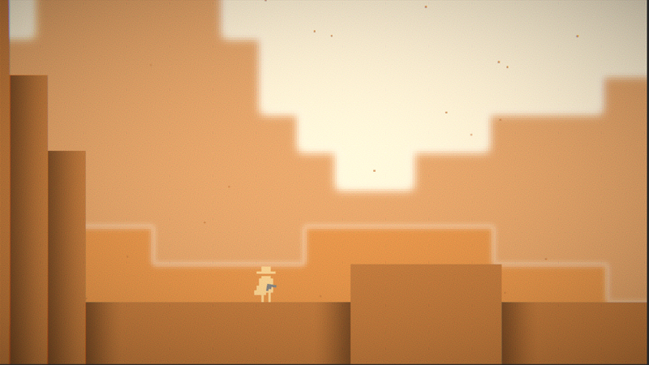

<h1 align="center">
 
Dusty Frontier
</h1>

<h4 align="center">A 2D side-scrolling platformer set in the treacherous Wild West. Using just your trusty revolver and a lasso, you must navigate through the unforgiving, lawless frontier.</h4>

  <a href="#project-overview">Project Overview</a> •
  <a href="#technical-stack">Technical Stack</a> •
  <a href="#collaborators">Collaborators</a> •
  <a href="#contact">Contact</a>

## Project Overview

Dusty Frontier invites you to step into the dusty boots of a daring gunslinger, where the rugged charm of the wild west meets dangerous and strategic action. Get ready to experience the untamed frontier in this thrilling 2D platformer that packs a punch with every pixel.

#### Key Features:

* <strong>Shoot 'em Up:</strong> Engage in various shootouts with a variety of formidable foes, from ruthless outlaws to menacing wildlife. Your quick draw skills will be put to the test!
* <strong>Lasso Mastery:</strong> Harness the power of your trusty lasso for acrobatic maneuvers and traversing treacherous terrain. It's your ultimate tool for survival.
* <strong>Stunning Pixel Visuals:</strong> Immerse yourself in the wild west atmosphere with a simplified, yet characteristic art style. With additional post-processing and cinematic lighting, this adventure brings the dusty, sun-soaked landscape to life.

## Technical Stack

 

## Collaborators

<h3>Carson Strout:</h3>

Designer • Programmer • Artist

## Contact

<h3>Carson Strout</h3>

 
 
